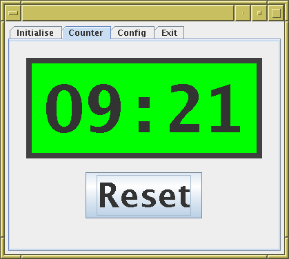

# deadman

Dead man's alarm 

Simple java application suggested by Ben Maughan.

Posts a GUI countdown timer on the screen, when it reaches zero it
sounds an alarm or something.

The intention is to use it in the observatory to guard against
people having an accident and not being able to raise the alarm.



## Build/run

A makefile is included.  On a Un*x system, just do
```
   make build
```
to create the jar file (`deadman.jar`).
Then you can run it with
```
   java -jar deadman.jar
```

## Configuration

There are various configuration options, which you can set in
various ways.  Some of the options are (re)configurable from
within the application.  You can set the defaults from the command line
or a configuration file, using `name=value` assignments.

To see the options, run:
```
   java -jar deadman.jar -h
```

To set, e.g., the default reset time to 180 seconds, you can run
```
   java -jar deadman.jar reset=180
```
or you can include the line
```
   reset=180
```
in a file `deadman.props`.  To write a skeleton config file, run
```
   java -jar deadman.jar -writeconfig
```
If you want to use a different config file, you can specify that on
the command line:
```
   java -jar deadman.jar config=myconfigfile.props
```

